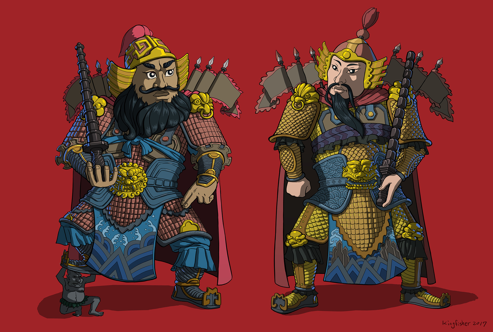
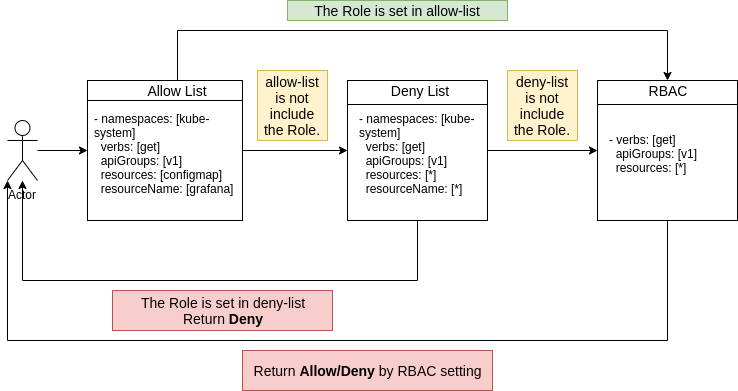
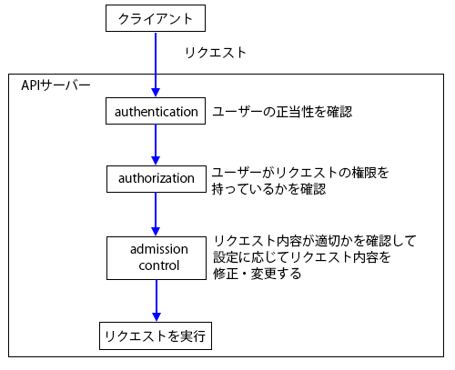

# MenShen 门神



门神，即司门守卫之神，是农历新年贴于门上的一种画类。 作为民间信仰的守卫门户的神灵，人们将其神像贴于门上，用以驱邪避鬼、卫家宅、保平安、助功利、降吉祥等，是中国民间深受人们欢迎的守护神。 按照传统习俗，每到春节前夕，家家户户便忙碌起来写挥春贴对联和门神，祈福来年。

### 关于 门神 (MenShen)
MenShen 项目是用于弥补和解决Kubernetes本身RBAC的设定项不足的问题。
例如，MenShen提供了自定义资源**用户组**的概念，可以帮助管理员将用户分组管理。

此外更重要的是，MenShen提供了RBAC(Role-based access control)不具备的**许可名单**，**禁止名单**等概念。可以帮助用户灵活设定各项资源的权限。
并且提供了**Namespace**设定项，将RBAC的设定颗粒度再次细化。

### 门神 (MenShen) 的执行逻辑

MenShen 的访问规则如下图


1. 当**许可名单**中匹配到了资源，请求将会被直接转送到RBAC进行确认。
2. 当**许可名单**中没有匹配到资源，请求将会被转送到**禁止名单**进行确认。
3. 当**禁止名单**中匹配到了资源，请求将会直接返回用户，并告知用户**该请求被拒绝**。
4. 当**禁止名单**中没有匹配到资源，请求将会转送到RBAC进行确认。

### 门神 (MenShen) 的使用样例

当用户被设定可以具备所有资源的查看权限，但是管理员并不想让用户可以查看**namespace**为**kube-system**的大部分资源。
只允许用户可以访问**namespace**为**kube-system**的**grafana**的配置文件**configmap**资源。

用户组设定YAML文件: *user-group.yaml*
```
apiVersion: auth.menshen.io/v1beta1
kind: GroupExt
metadata:
  name: normal-user-group
spec:
  users:
    - "chen.cheng"
```

禁止权限名单设定YAML文件: *roleext-kube-system-deny.yaml*
```
apiVersion: auth.menshen.io/v1beta1
kind: RoleExt
metadata:
  name: roleext-deny-sample
spec:
  roles:
    - namespaces:     [kube-system]
      apiGroups:      [*]
      verbs:          [*]
      resources:      [*]
      resourceNames:  [*]
```

许可权限名单设定YAML文件:*roleext-kube-system-grafana-cm-allow.yaml*
```
apiVersion: auth.menshen.io/v1beta1
kind: RoleExt
metadata:
  name: roleext-allow-sample
spec:
  roles:
    - namespaces:     [kube-system]
      apiGroups:      [v1]
      verbs:          [get]
      resources:      [configmap]
      resourceNames:  [grafana]
```

禁止权限名单绑定设定YAML文件: *rolebindingext-deny.yaml*
```
apiVersion: auth.menshen.io/v1beta1
kind: RoleBindingExt
metadata:
  name: rolebindingext-allow-sample
spec:
  subjects:
    - kind: group
      name: normal-user-group
  roleNames: [roleext-deny-sample]
  type: "deny"
```

许可权限名单绑定设定YAML文件: *rolebindingext-allow.yaml*
```
apiVersion: auth.menshen.io/v1beta1
kind: RoleBindingExt
metadata:
  name: rolebindingext-allow-sample
spec:
  subjects:
    - kind: group
      name: normal-user-group
  roleNames: [roleext-allow-sample]
  type: "allow"
```

### 使用 门神 (MenShen) 的常见问题

#### 1. 为什么不使用*Admission Control*，而使用*MenShen*?

admission control 会 晚于 authoriation 执行，而**门神 MenShen**的执行位置在authentication 和 authorization 之间。
所以**门神 MenShen**会在检验完**许可权限名单**和**禁止权限名单**之后，再去验证RBAC权限。



#### 2. 和 **Open Policy Agent**的比较优势
[Open Policy Agent](https://www.openpolicyagent.org/)是CNCF的孵化项目，本身具有设定灵活的特点。

但是设定灵活也恰恰变成了其最大缺点，首先就体现在其设定复杂，Open Policy Agent 在使用的时候，先要学习其特殊的游乐园语法。
该语法较为晦涩，更重要的是，资料很少。**门神 MenShen**完全使用声明式结构，简单易懂。

其次，Open Policy Agent的定义用途过于宽泛，导致其对细分领域的支持内容较少，**门神 MenShen**在我的了解情况下，
应该是世界第一个正式用于Kubernetes authorization webhook的云原生项目。其使用方式，应该更适合Kubernetes的使用。

#### 3. 门神 (MenShen) 适用的Kubernetes集群
**门神 (MenShen) 不支持 GKE, AKE** 等不能设定APIServer的Kubernetes集群。 

### 门神 (MenShen) 的今后路线

- [ ] 定时功能
- [ ] 优化搜索算法
- [ ] 简易部署